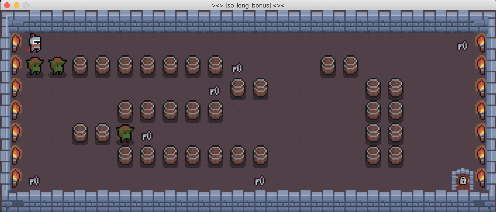

<div align="center" max-width="auto" max-height="auto">
	
</div>

<br>

<div align="center">
<span>
	
</span>
</div>

<br>

# 🎮 so_long ...and thanks for all the fish 🐟

## Content

[Summary](https://github.com/D-Dashka/so_long#-summary)

[Game](https://github.com/D-Dashka/so_long#-game)

[Map](https://github.com/D-Dashka/so_long#-map)

[Bonus](https://github.com/D-Dashka/so_long#-bonus)

[How to run](https://github.com/D-Dashka/so_long#-how-to-run)

[Sources](https://github.com/D-Dashka/so_long#-sources)

## 📄 Summary

This project is a very small 2D game.

Its purpose is to make you work with textures, sprites, and some other very basic gameplay elements.

It is my first computer graphic project at School21 where we need to use graphic library: Minilibx.

The program <code>so_long</code> should take map as a parameter and display game in a window.

## 🎮 Game

• The player’s goal is to collect every collectible present on the map, then escape chosing the shortest possible route.

• The ***W, A, S***, and ***D*** keys must be used to move the main character.

• The player should be able to move in these 4 directions: ***up, down, left, right***.

• The player should not be able to move into walls.

• At every move, the current number of movements must be displayed in the shell.

• You have to use a 2D view (top-down or profile).

## 🗺 Map 

The map can be composed of only these 5 characters:

`0` for an empty space,

`1` for a wall,

`C` for a collectible,

`E` for a map exit,

`P` for the player’s starting position

`V` villain 😈 for bonus part

<details>
  <summary>Map rules</summary>
  
• The map has to be constructed with 3 components: **walls, collectibles, and free space**

• The map must contain at least **1 exit, 1 collectible,** and **1 starting position**.

• The map must be **rectangular**.

• The map must be **closed/surrounded by walls**. If it’s not, the program must return an error.

• You don’t have to check if there’s a valid path in the map.

• You must be able to parse any kind of map, as long as it respects the above rules.
</details>

All maps are located in <code>maps</code> directory.

## 😈 Bonus

• Make the player lose when they touch an enemy patrol.

• Add some sprite animation.

• Display the movement count directly on screen instead of writing it in the shell.

1. **Enemy**

Calculate the number of empty spaces and put an enemy proportionally.

Or put villain before - ***that what I did***

2. **Display steps in window**

```c
int
mlx_string_put(void *mlx_ptr, void *win_ptr, int x, int y, int color, char *string);
```

3. **Animation**

Can be implemented using static variable.

***Example with collectibles rotation***

```c
void	ft_collectibles_animation(t_data *data)
{
	static int	i; //static variable incremented
    //changing picture on certain counter value
    //lesser counter -> faster speed
    if (i == 0)
    	ft_put_img(COLLECT_1, w, h, data);
    else if (i == 2500)
    	ft_put_img(COLLECT_2, w, h, data);
	else if (i == 4500)
   		ft_put_img(COLLECT_3, w, h, data);
	else if (i == 6500)
    		ft_put_img(COLLECT_4, w, h, data);
	else if (i == 8500)
   		ft_put_img(COLLECT_5, w, h, data);
   	else if (i == 10500)
		ft_put_img(COLLECT_6, w, h, data);
	else if (i == 12500)
		ft_put_img(COLLECT_1, w, h, data);
    	
    i += 1;
    if (i > 12500)
    	i = 0;
}
```

I tried to make villains chasing my player.

***choosing enemy moving direction***
```c
mid_height = map height / 2;
mid_width = map width / 2

player is on the left side of the map or enemy is on the oppposite side of the player
if (player_pos_x < mid_width || enemy_position_x > player_pos_x)
	move enemy left;

player is on the right side 
else if (player_pos_x > mid_width || enemy_position_x > player_pos_x)
	move enemy right;

player is on the top side or enemy is on the bottom
else if (player_pos_y < mid_height || enemy_position_y > player_pos_y)
	move enemy up;

player is on the bottom or enemy is on the top
else if (player_pos_y > mid_height || enemy_position_y < player_pos_y)
	move enemy down;
```

## 🏁 How to run

make compile both <code>so_long</code> and <code>so_long_bonus</code> programs

	make

To run game with animation you can run <code>so_long_bonus</code> program with map as argument with *_bonus* suffix. 

All maps are located in <code>maps</code> directory.

For example

	./so_long_bonus maps/21_bonus.ber

### Game preview

**⚠️** Be aware of enemies!!! 

<div align="center" max-width="auto" max-height="auto">
	
</div>

## 🔗 Sources:

Assets I used to create a game

<span>https://pixel-poem.itch.io/dungeon-assetpuck</span>
<br>
<span>https://o-lobster.itch.io/simple-dungeon-crawler-16x16-pixel-pack</span>

Original assets I used: <span><a href="https://drive.google.com/drive/folders/14UOrUH1qbSXTieiQ9UGwmhTt9L7rXVa0?usp=sharing">Link to my drive</span>
